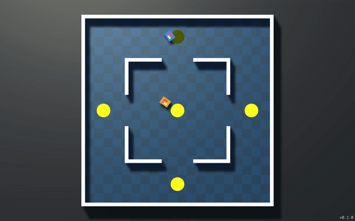

# codearena-controllers

This repository contains the API libraries and bot controller examples for the CodeArena game.

## What is CodeArena?
CodeArena is a game where you compete through code. Control your bot with a script and try to destroy your opponent before they destroy you!

Whether you're looking to learn programming from scratch or challenge your friends to a duel of wits, CodeArena is simple to pick up but difficult to master.

<p align=middle>
  
   
</p>

## Quickstart guide
> Currently, only a Python library is available for controlling the bots. You can download Python 3 [here](https://www.python.org/downloads/).
1. Download the CodeArena game for [Mac](https://github.com/mycoolfin/codearena-controllers/releases/latest/download/CodeArena.dmg) or [Windows](https://github.com/mycoolfin/codearena-controllers/releases/latest/download/CodeArena.exe).
2. Download and unzip [codearena-controllers](https://github.com/mycoolfin/codearena-controllers/archive/master.zip).
3. Run CodeArena and click **Start**. In the top right corner, you should see 'Waiting for Blue' and 'Waiting for Orange'.
4. To connect the bots to controller scripts, open a terminal and navigate to the **`codearena-controllers-master/python`** directory.
5. Run the following command:
    ```
    python3 start.py
    ```
    > Depending on your system, you might need to run `python start.py` instead.
6. Return to the CodeArena game. In the top right corner you should now see 'Press SPACE to begin'.
7. Hit spacebar to begin the match.

## Writing your own controller
1. Navigate to the **`codearena-controllers-master/python/controllers`** directory.
2. Copy the **`controller_template.py`** file to a new file, e.g. **`my_bot.py`**.
3. In **`codearena-controllers-master/python`**, open **`start.py`** in an editor.
4. Change `BLUE_SCRIPT` to `"controllers/my_bot.py"`.
5. You can now write your own controller code in **`my_bot.py`** and run `python3 start.py` to connect to the bots.
> Check out the [Python API reference](python/docs/python-api.md) for a list of commands you can use to control your bot.
